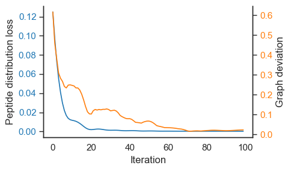
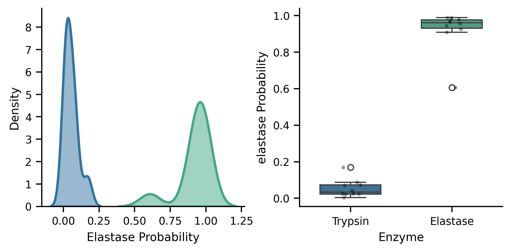

# Modelling Protein Degradation Graphs

[](https://opensource.org/licenses/MIT)

This repository contains the code implementation for  modeling protein degradation processes through graphs.




## Overview

This project presents computational methods for modeling and predicting proteolytic processes using graph-based approaches. We implement several algorithms for simulating enzyme activity, optimizing graph parameters, and solving for edge probabilities in directed acyclic graphs (DAGs) representing protein degradation pathways.

## Repository

```
├── data/
│   ├── actb_trp.csv           # β-actin trypsin digestion 
├── src/
│   ├── enzyme_gnn.py          # Graph Neural Network model for enzyme activity prediction
│   ├── fig3_opt_on_graph.ipynb # Example optimization on graph structures
│   ├── proteolysis_simulator.py # Simulator for proteolytic events
│   ├── solver_cd.py           # Coordinate descent solver
│   ├── solver_gd.py           # Gradient descent solver
│   ├── solver_lp.py           # Linear programming solver
├── LICENSE                     # MIT License
└── README.md                  # This file
```

## Installation

Clone this repository:

```bash
git clone https://github.com/yourusername/public-degradation-graphs.git
cd public-degradation-graphs
```

### Requirements

This project requires Python and the following dependencies:

```bash
pip install numpy scipy pandas matplotlib seaborn networkx torch torch-geometric scikit-learn pulp
```


## Usage

### Proteolysis Simulation

A proteolysis simulator is defined in `proteolysis_simulator.py`. It enables the modeling of enzyme activity on protein sequences:

```python
from proteolysis_simulator import Enzyme, ProteolysisSimulator

# Define an enzyme with specific cleavage rules (e.g., trypsin)
trypsin = Enzyme([("(.)(.)([R|K])([^P])(.)(.)", 1)])

# Define a protein sequence
protein_sequence = "MDDDIAALVVDNGSGMCKAGFAGDDAPRAVFPSIVGRPR"

# Initialize simulator and generate peptides
simulator = ProteolysisSimulator(protein_sequence)
peptides = simulator.simulate_digestion(trypsin, n_steps=100)
```

### Graph Neural Network for Enzyme Activity Prediction

The `enzyme_gnn.py` module implements a GraphSAGE model to predict graph types.




### Graph Optimization

To use the solvers for optimizing degradation graphs:

```python
import networkx as nx
from solver_lp import run_lp

# Create a directed acyclic graph
G = nx.DiGraph()
G.add_edges_from([("Omega", "A"), ("A", "B"), ("A", "C"), 
                 ("Omega", "D"), ("Omega", "E"), ("E", "F")])

# Define target absorption distribution
Y = {"A": 0.1, "B": 0.2, "C": 0.3, "D": 0.1, "E": 0.1, "F": 0.2}

# Run linear programming solver
edge_probs, absorption = run_lp(G, Y, root="Omega")
```

## Acknowledgments

- [NetworkX](https://networkx.org/) for graph manipulation and analysis
- [PyTorch](https://pytorch.org/) and [PyTorch Geometric](https://pytorch-geometric.readthedocs.io/) for the GNN implementation
- [PuLP](https://coin-or.github.io/pulp/) for linear programming optimization
