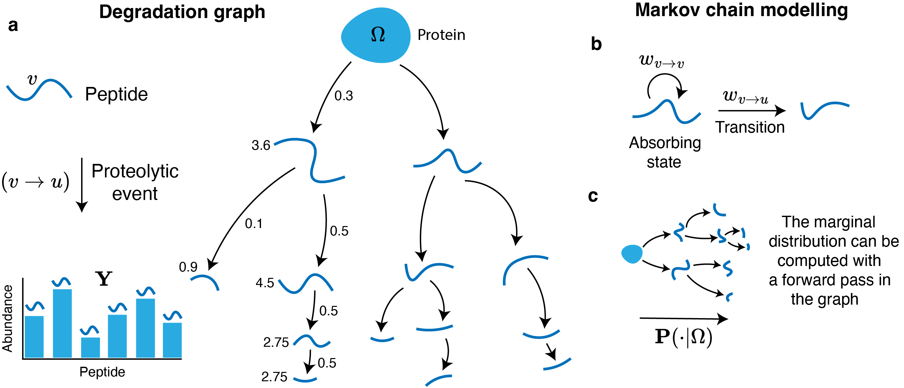
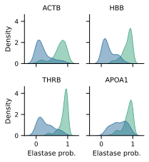

# Modeling Protein Degradation Graphs

[](https://opensource.org/licenses/MIT)

This repository contains the code implementation for modeling protein degradation processes through graphs and machine learning approaches for proteomics analysis.




## Overview

This project presents computational methods for modeling and predicting proteolytic processes using graph-based approaches. We implement several algorithms for simulating enzyme activity, optimizing graph parameters, and solving for edge probabilities in directed acyclic graphs (DAGs) representing protein degradation pathways.

## Overview

This project presents computational methods for modeling and predicting proteolytic processes using graph-based approaches and machine learning. We implement algorithms for simulating enzyme activity, optimizing graph parameters, and solving for edge probabilities in directed acyclic graphs (DAGs) representing protein degradation pathways. The repository includes analysis of both synthetic and real-world proteomics datasets, including diabetes and infection studies.

## Repository Structure

```
├── data/
│   ├── actb_trp.csv              # β-actin trypsin digestion data
│   ├── degradomics_2025_02_06.csv # Degradomics dataset (February)
│   ├── degradomics_2025_10_02.csv # Degradomics dataset (October)
│   ├── peptidomics_2025_02_06.csv # Peptidomics dataset (February)
│   ├── peptidomics_2025_10_02.csv # Peptidomics dataset (October)
│   ├── diabetes/               # Diabetes study data
│   │   ├── design.csv         # Experimental design
│   │   └── peptides.txt       # Peptide sequences
│   └── infection/             # Infection study data
│       ├── data.csv          # Raw data
│       └── design.csv        # Experimental design
├── src/
│   ├── enzyme_gnn.py             # Graph Neural Network for enzyme activity prediction
│   ├── proteolysis_simulator.py  # Proteolytic process simulator
│   ├── solver_cd.py              # Coordinate descent solver
│   ├── solver_gd.py              # Gradient descent solver
│   ├── solver_lp.py              # Linear programming solver
│   ├── util.py                   # Utility functions and graph operations
│   ├── weight_optimizer.py       # Weight optimization algorithms
│   ├── optimization_demo.ipynb   # Optimization demonstration notebook
│   ├── term_trends.ipynb         # Terminal trends analysis notebook
│   └── in_vivo/                  # In vivo analysis scripts
│       ├── diabetes.py           # Diabetes dataset analysis
│       └── infection.py          # Infection dataset analysis
├── results/
│   ├── figures/                  # Generated figures and visualizations
│   │   ├── enzyme_distributions.svg
│   │   ├── multi_protein_roc.svg
│   │   ├── peptide_distribution_loss.png
│   │   └── term_trends.svg
│   └── outputs/                  # Model outputs and results
│       ├── data_split.pkl
│       └── model_results.pkl
├── LICENSE                       # MIT License
└── README.md                    # This file
```

## Installation

Clone this repository:

```bash
git clone https://github.com/ErikHartman/degradation-graphs.git
cd degradation-graphs
```

### Environment Setup

This project uses a virtual environment. To set up the environment:

```bash
# Create and activate virtual environment
python -m venv .venv
source .venv/bin/activate  # On macOS/Linux
# or
.venv\Scripts\activate     # On Windows

# Install dependencies
pip install numpy scipy pandas matplotlib seaborn networkx torch torch-geometric scikit-learn pulp
```


## Usage

### Proteolysis Simulation

The proteolysis simulator in `proteolysis_simulator.py` enables modeling of enzyme activity on protein sequences:

```python
from src.proteolysis_simulator import Enzyme, ProteolysisSimulator

# Define an enzyme with specific cleavage rules (e.g., trypsin)
trypsin = Enzyme([("(.)(.)([R|K])([^P])(.)(.)", 1)])

# Define a protein sequence
protein_sequence = "MDDDIAALVVDNGSGMCKAGFAGDDAPRAVFPSIVGRPR"

# Initialize simulator and generate peptides
simulator = ProteolysisSimulator(protein_sequence)
peptides = simulator.simulate_digestion(trypsin, n_steps=100)  # Returns dict of peptide:abundance
```

### Graph Neural Network for Enzyme Activity Prediction

The `enzyme_gnn.py` module implements a GraphSAGE model for predicting enzyme activity patterns:



### Weight Optimization

The `weight_optimizer.py` module provides multiple optimization algorithms:

```python
from src.weight_optimizer import WeightOptimizer
import networkx as nx

# Create a directed acyclic graph
G = nx.DiGraph()
G.add_edges_from([("Omega", "A"), ("A", "B"), ("A", "C"), 
                 ("Omega", "D"), ("Omega", "E"), ("E", "F")])

# Define target absorption distribution
Y = {"A": 0.1, "B": 0.2, "C": 0.3, "D": 0.1, "E": 0.1, "F": 0.2}

# Initialize optimizer and run linear programming
optimizer = WeightOptimizer()
optimizer.linear_programming(G, Y, root="Omega")
```

### In Vivo Analysis

Run analysis on real-world datasets:

```bash
# Analyze diabetes dataset
python src/in_vivo/diabetes.py

# Analyze infection dataset
python src/in_vivo/infection.py
```

### Notebooks

Interactive analysis notebooks are available in the `src/` directory:
- `optimization_demo.ipynb`: Demonstrates optimization algorithms on graph structures
- `term_trends.ipynb`: Analysis of terminal trends in degradation processes

## Results

Generated figures and analysis results are stored in the `results/` directory:
- `figures/`: Visualizations including ROC curves, distributions, and trends
- `outputs/`: Serialized model results and data splits

## Acknowledgments

- [NetworkX](https://networkx.org/) for graph manipulation and analysis
- [PyTorch](https://pytorch.org/) and [PyTorch Geometric](https://pytorch-geometric.readthedocs.io/) for the GNN implementation
- [PuLP](https://coin-or.github.io/pulp/) for linear programming optimization
